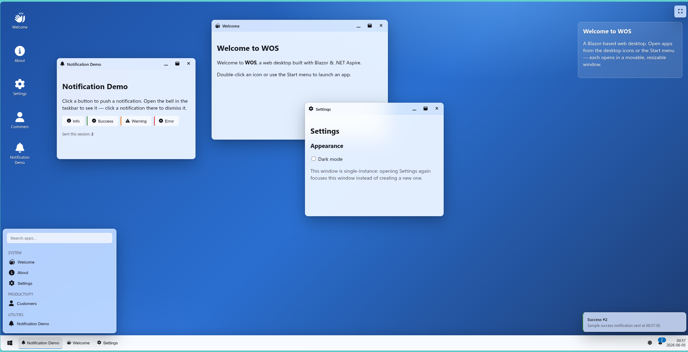

# WOS — Blazor Web Desktop Framework on .NET Aspire

A reusable, browser-based **"web desktop"** shell built with **Blazor (Interactive Server)**,
**.NET 10** and **.NET Aspire**. Any Blazor component can be registered as an *app* and opened
inside a movable, resizable, minimizable / maximizable window — like a Windows / Ubuntu desktop
running in the browser, with a glass (acrylic) look, a taskbar, a start menu, notifications and
theming.



## Demo

<video src="media/file0.webm" controls width="100%"></video>

> If the player above doesn't appear, watch it here: [media/file0.webm](media/file0.webm)

---

## Features

- 🪟 **Windowing** — open/close, focus & z-ordering, move, resize (8 handles), minimize,
  maximize/restore, single- and multi-instance apps, window cascade.
- 🖱️ **Smooth drag & resize** — handled by a JS module (pointer events) so gestures never
  round-trip to the server; final geometry is committed back to Blazor on gesture end.
- 🧩 **Dynamic apps** — register any Razor component as an app; it renders in a window via
  `DynamicComponent`, with parameters passed in.
- 🟦 **Taskbar** — a button per open window (active highlighted), click to focus / minimize,
  start button, system tray with clock, theme toggle and a live notification badge.
- 🔍 **Start menu** — apps grouped by category, live search.
- 🖥️ **Desktop icons** — launch apps by double-click (or Enter/Space).
- 🔔 **Notifications** — a client-side store, a bell panel (click an item to dismiss, "clear all"),
  and **toasts** that pop bottom-right then fade out while the item stays in the list.
- 🎨 **Glassmorphism theming** — translucent acrylic surfaces (`backdrop-filter`), light/dark
  themes via CSS variables, persisted to `localStorage`.
- 🆎 **Font Awesome 6 (free)** icons throughout (app icons are just FA class strings).
- ⛶ **Fullscreen** toggle button (top-right) using the browser Fullscreen API.
- ⏳ **Busy/loading cursor** — `BusyService` flips the whole desktop to the OS wait cursor while
  async work runs (e.g. a slow API call).
- 🔐 **Login + roles** — a configurable **two-step** sign-in (step 1: credentials → step 2:
  pick **company** / **role**) that calls an auth API and stores the session in **sessionStorage**.
  The whole flow is driven by `LoginFlowOptions`, so a project can disable step 2
  (`EnableContextStep = false`) for a plain single-step login, or toggle/require each selector.
  Apps can require roles (`AppDescriptor.RequiredRoles`) and are hidden for users who lack them.
- 🛡️ **Resilient errors** — API failures (400/401/403/404/408/429/5xx, timeouts, network down)
  return as data and render a friendly in-window error panel with **Retry**; an `ErrorBoundary`
  around each window contains unexpected crashes to that window — the desktop never goes down.
- 💾 **Persistence** — window layout (position/size/state/z-order) and theme survive reloads
  via `localStorage`, behind an `IDesktopPersistence` seam that can later move to a backend.
- ☁️ **Aspire-native** — orchestration, service discovery, health, OpenTelemetry and resilient
  `HttpClient`s from day one. The Blazor app calls the API by logical name, not a hardcoded URL.

---

## Quick start

**Prerequisites:** .NET 10 SDK.

```bash
dotnet run --project DesktopFramework.AppHost
```

This boots the **Aspire dashboard** plus both resources (`web` + `api`). Open the **web**
endpoint listed in the dashboard. The desktop loads its welcome content and notifications from
`DesktopFramework.Api` through Aspire **service discovery**.

> The Font Awesome stylesheet is loaded from a CDN, so the first run needs internet access for
> icons to appear. (See *Offline icons* below to self-host.)

Build / test only:

```bash
dotnet build WOS.slnx
```

---

## Solution structure

| Project | Type | Responsibility |
|---|---|---|
| `DesktopFramework.AppHost` | Aspire App Host | Orchestrates `web` + `api`; wires service discovery (`WithReference`, `WaitFor`). |
| `DesktopFramework.ServiceDefaults` | Library | Telemetry, health checks, service discovery, `HttpClient` resilience. |
| `DesktopFramework.Contracts` | Library | DTOs shared by API + Web: `DesktopAppDto`, `ContentDto`, `NotificationDto`. |
| `DesktopFramework.Api` | ASP.NET Core (Minimal API) | In-memory content API (no DB in v1). |
| `DesktopFramework.Core` | Library (no Razor) | Windowing models + services. The framework "brain". |
| `DesktopFramework.Components` | Razor Class Library | The desktop UI + JS interop + theme CSS. Reusable. |
| `DesktopFramework.SampleApps` | Razor Class Library | Demo apps proving registration. |
| `DesktopFramework.Web` | Blazor Web App (Interactive Server) | Host: API client, persistence impl, DI wiring, registers apps. |

**Reference flow:** `AppHost → web, api` · `ServiceDefaults ← web, api` ·
`Contracts ← api, web, core` · `Core ← Components, SampleApps, Web` ·
`Components ← SampleApps, Web` · `SampleApps ← Web`.

The **three framework libraries are published as NuGet packages**; the rest
(`AppHost`, `Api`, `Web`, `SampleApps`, `ServiceDefaults`) are the runnable sample/host
and are not packed.

| Package | What it gives you |
|---|---|
| `DesktopFramework.Contracts` | The DTOs. Reference from your **backend API** and your app. |
| `DesktopFramework.Core` | Windowing engine + services + interfaces (no Razor). Depends on Contracts. |
| `DesktopFramework.Components` | Blazor UI + JS/CSS + default browser-storage. Depends on Core. **This is the one your app installs.** |

---

## Use it in your own Blazor app

```bash
dotnet add package DesktopFramework.Components
```

`Program.cs`:

```csharp
builder.Services.AddRazorComponents().AddInteractiveServerComponents();
builder.Services.AddDesktopFramework();   // windowing, UI, theming, browser storage — all wired
```

Reference the framework stylesheet in your host page (`App.razor` head) and Font Awesome:

```html
<link rel="stylesheet" href="@Assets["_content/DesktopFramework.Components/css/desktop-framework.css"]" />
<link rel="stylesheet" href="https://cdnjs.cloudflare.com/ajax/libs/font-awesome/6.7.2/css/all.min.css" />
```

Register your apps and drop in the shell (an interactive component):

```razor
@rendermode InteractiveServer
@inject AppRegistry Registry

<DesktopShell />

@code {
    protected override void OnInitialized() =>
        Registry.Register(new AppDescriptor
        {
            Id = "customers", Title = "Customers", Icon = "fa-solid fa-user",
            ComponentType = typeof(CustomerPage), AllowMultipleInstances = true,
        });
}
```

It runs out-of-the-box with no backend (notifications empty, login reports "not configured").
To connect a backend, register your own implementations — they override the defaults:

```csharp
builder.Services.AddScoped<IDesktopContentService, MyContentClient>(); // your API
builder.Services.AddScoped<IAuthApiClient, MyAuthClient>();            // your API
builder.Services.AddScoped<IPermissionService, PermissionService>();   // enable role gating
```

(See `DesktopFramework.Web/Services/*` and `DesktopFramework.Api` for working examples.)

---

## Packaging & publishing

Package metadata is shared in `Directory.Build.props` (version, authors, license, repo).
Only the three framework libraries set `<IsPackable>true</IsPackable>`.

```bash
# produces .nupkg + .snupkg for Contracts, Core and Components in ./artifacts
dotnet pack WOS.slnx -c Release -o ./artifacts

# publish (set your API key / source)
dotnet nuget push "artifacts/*.nupkg" --source https://api.nuget.org/v3/index.json --api-key <KEY>
```

The Components package bundles its `wwwroot` as **static web assets**, so consumers get the
JS/CSS automatically under `_content/DesktopFramework.Components/…`. Versions are kept in lockstep
via the single `<Version>` in `Directory.Build.props`, and project references pack as matching
package dependencies.

> Before publishing to nuget.org: bump `<Version>`, set the real `RepositoryUrl` /
> `PackageProjectUrl` in `Directory.Build.props`, and pick **globally-unique** package IDs
> (e.g. a `YourCompany.` prefix) — the `DesktopFramework.*` IDs are placeholders.

---

## Core concepts

### Services (in `DesktopFramework.Core`, all scoped — one desktop per circuit)

| Service | Role |
|---|---|
| `WindowManager` | Single source of truth for open windows: open/close/focus/min/max/restore/move/resize. Raises `Changed`. |
| `AppRegistry` | Catalog of registered apps; filtered queries for desktop / start menu / permissions. |
| `ZIndexManager` | Central z-index allocator (no ad-hoc z-index in the UI). |
| `DesktopStateService` | Shell chrome state (start menu / notification panel open flags). |
| `ThemeService` | Current theme, light/dark toggle, persisted. |
| `NotificationService` | Client-side notification store: `Add`, `Dismiss`, `Clear`; `Added` event drives toasts. |
| `WindowPersistenceService` | Debounced save/restore of window layout via `IDesktopPersistence`. |

**Seams the host implements** (in `DesktopFramework.Web`):
`IDesktopContentService` → `DesktopApiClient` (typed `HttpClient`),
`IDesktopPersistence` → `LocalStoragePersistence` (JS `localStorage`),
`IPermissionService` → default `AllowAllPermissionService` (auth-ready for later).

### Backend API

| Method | Route | Returns |
|---|---|---|
| GET | `/api/apps` | `DesktopAppDto[]` |
| GET | `/api/content/welcome` | `ContentDto` |
| GET | `/api/content/about` | `ContentDto` |
| GET | `/api/notifications` | `NotificationDto[]` |

---

## Registering an app

Icons are **Font Awesome class strings** (or an emoji — both work).

```csharp
registry.Register(new AppDescriptor
{
    Id = "customers",
    Title = "Customers",
    Icon = "fa-solid fa-user",
    ComponentType = typeof(CustomerApp),
    Category = DesktopAppCategory.Productivity,
    AllowMultipleInstances = true,
    DefaultWindowOptions = new WindowOptions { InitialSize = new(480, 340) },
});
```

Open it (optionally with parameters / a de-dup key):

```csharp
windowManager.OpenApp("customers", new AppLaunchOptions
{
    InstanceKey = "42",
    Parameters = new Dictionary<string, object?> { ["CustomerId"] = 42 },
});
```

The component renders inside its window via `DynamicComponent`; `Parameters` keys must match the
target component's `[Parameter]` properties. Single-instance apps refocus instead of duplicating;
multi-instance apps open separate windows (de-duped by `InstanceKey` when provided).

The bundled sample apps are **Welcome**, **About**, **Settings** (single-instance), **Customers**
(multi-instance with a `CustomerId` parameter), **Notification Demo**, and **Data Loader**
(loads from a slow endpoint to show the busy cursor) — registered in
`SampleApps/SampleAppRegistration.cs` and wired from `Web/Components/Pages/Home.razor`.

### Showing the busy cursor during async work

```csharp
@inject BusyService Busy
...
_data = await Busy.RunAsync(() => Content.GetReportAsync());
// Desktop shows the OS wait cursor for the whole duration; reference-counted,
// so concurrent operations behave correctly.
```

### Pushing a notification from an app

```csharp
@inject NotificationService Notifications
...
Notifications.Add("Saved", "Customer #42 updated.", severity: "success");
// → appears as a toast bottom-right, then settles into the bell panel.
```

`severity` is one of `info | success | warning | error`.

---

## Theming

All chrome reads CSS variables defined in
`Components/wwwroot/css/desktop-framework.css`; `[data-theme="dark"]` swaps the set. Override the
variables (e.g. `--wos-accent`, `--wos-desktop-bg`, `--wos-glass-blur`) to reskin the desktop
without touching components. The sun/moon button in the tray toggles dark mode and persists it.

### Offline icons

Font Awesome is currently referenced from a CDN in `Web/Components/App.razor`. To work fully
offline, install the free package (e.g. via libman/npm) and point the `<link>` at the local copy
under `wwwroot`.

---

## Architecture notes

- **Render mode:** Interactive Server. API calls live server-side so Aspire service discovery
  "just works"; drag/resize stays smooth because JS owns the gesture.
- **State flow:** components mutate state only through services; services raise events; components
  re-render. No component-to-component mutation.
- **Per-circuit state:** services are scoped, so each connected user gets their own desktop.
- **Persistence v1:** window layout + theme in `localStorage`. Notifications are in-memory per
  session. The `IDesktopPersistence` seam lets this move to an Aspire backend service later.

See `.claude/plans/` for the full technical plan, phase breakdown and the future-services design
(Settings/Notifications/Identity/Files APIs).

---

## Project layout (key files)

```
DesktopFramework.Core/
  Windowing/        WindowInstance, WindowOptions, WindowState, geometry, WindowCommand
  Apps/             AppDescriptor, AppLaunchOptions, DesktopAppCategory, IDesktopApp
  Services/         WindowManager, AppRegistry, ZIndexManager, DesktopStateService,
                    ThemeService, NotificationService, WindowPersistenceService, interfaces
DesktopFramework.Components/
  Desktop/          DesktopShell, DesktopBackground, DesktopIcon, Taskbar, FullscreenButton
  Windowing/        WindowHost, AppWindow, WindowTitleBar, WindowContent
  Layout/           StartMenu, ContextMenu, NotificationArea, NotificationToasts
  Widgets/          WelcomeWidget
  Icon.razor
  wwwroot/js/window-interop.js     (drag, resize, localStorage, theme, fullscreen)
  wwwroot/css/desktop-framework.css
DesktopFramework.Web/
  Services/         DesktopApiClient, LocalStoragePersistence
  Components/Pages/Home.razor       (hosts <DesktopShell/>, registers apps)
  Program.cs
```

---

## Roadmap

- Persist notifications and per-icon positions.
- Right-click context menus on desktop / icons / taskbar (component exists, not yet wired).
- Pinned taskbar apps, Alt-Tab switcher.
- Real Aspire backend services behind the existing seams (Settings, Notifications, Identity, Files).
- Authentication + permission enforcement (the `AppDescriptor` already carries
  `RequiredRoles/Claims/Permissions`).
